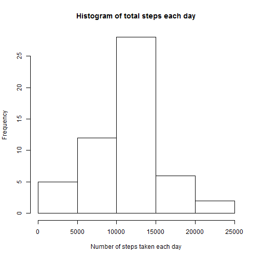
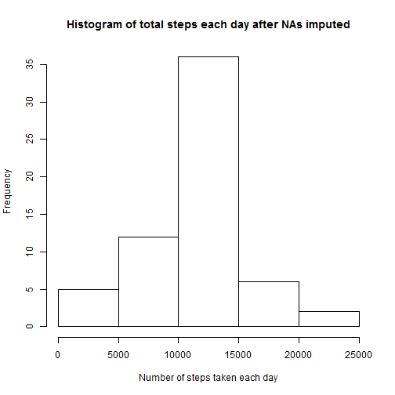

###Loading and preprocessing the data


```r
#1.Load the data (i.e. read.csv())
ActivityData <- read.csv("C:\\Big Data\\Data Science Specialization\\Reproducible Research\\Week 2\\activity.csv")

#2.Process/transform the data (if necessary) into a format suitable for your analysis
names(ActivityData)
```

```
## [1] "steps"    "date"     "interval"
```

```r
head(ActivityData,3)
```

```
##   steps       date interval
## 1    NA 2012-10-01        0
## 2    NA 2012-10-01        5
## 3    NA 2012-10-01       10
```

```r
tail(ActivityData,3)
```

```
##       steps       date interval
## 17566    NA 2012-11-30     2345
## 17567    NA 2012-11-30     2350
## 17568    NA 2012-11-30     2355
```

###What is mean total number of steps taken per day?

```r
#Data set with No NAs.
NoNAActivity <- ActivityData[complete.cases(ActivityData),]

#1.Calculate the total number of steps taken per day
#TotalStepsEachDay is the new data frame with first column 'date' and second column 'TotalSteps'
TotalStepsEachDay <- aggregate(NoNAActivity$steps, by=list(NoNAActivity$date), FUN=sum)
names(TotalStepsEachDay) <- c("date","TotalSteps")
TotalStepsEachDay
```

```
##          date TotalSteps
## 1  2012-10-02        126
## 2  2012-10-03      11352
## 3  2012-10-04      12116
## 4  2012-10-05      13294
## 5  2012-10-06      15420
## 6  2012-10-07      11015
## 7  2012-10-09      12811
## 8  2012-10-10       9900
## 9  2012-10-11      10304
## 10 2012-10-12      17382
## 11 2012-10-13      12426
## 12 2012-10-14      15098
## 13 2012-10-15      10139
## 14 2012-10-16      15084
## 15 2012-10-17      13452
## 16 2012-10-18      10056
## 17 2012-10-19      11829
## 18 2012-10-20      10395
## 19 2012-10-21       8821
## 20 2012-10-22      13460
## 21 2012-10-23       8918
## 22 2012-10-24       8355
## 23 2012-10-25       2492
## 24 2012-10-26       6778
## 25 2012-10-27      10119
## 26 2012-10-28      11458
## 27 2012-10-29       5018
## 28 2012-10-30       9819
## 29 2012-10-31      15414
## 30 2012-11-02      10600
## 31 2012-11-03      10571
## 32 2012-11-05      10439
## 33 2012-11-06       8334
## 34 2012-11-07      12883
## 35 2012-11-08       3219
## 36 2012-11-11      12608
## 37 2012-11-12      10765
## 38 2012-11-13       7336
## 39 2012-11-15         41
## 40 2012-11-16       5441
## 41 2012-11-17      14339
## 42 2012-11-18      15110
## 43 2012-11-19       8841
## 44 2012-11-20       4472
## 45 2012-11-21      12787
## 46 2012-11-22      20427
## 47 2012-11-23      21194
## 48 2012-11-24      14478
## 49 2012-11-25      11834
## 50 2012-11-26      11162
## 51 2012-11-27      13646
## 52 2012-11-28      10183
## 53 2012-11-29       7047
```

```r
#2.Make a histogram of the total number of steps taken each day
hist(TotalStepsEachDay[,2],xlab="Number of steps taken each day",main="Histogram of total steps each day")
```

 

```r
#3.Calculate and report the mean and median of the total number of steps taken per day
round(mean(TotalStepsEachDay$TotalSteps))
```

```
## [1] 10766
```

```r
median(TotalStepsEachDay$TotalSteps)
```

```
## [1] 10765
```

###What is the average daily activity pattern?

```r
#1.Make a time series plot of the 5-minute interval and the average number of steps taken, averaged across all days 
activity_pattern <- aggregate(NoNAActivity$steps, list(as.numeric(NoNAActivity$interval)), FUN="mean")
names(activity_pattern) <- c("interval","steps")
plot(activity_pattern, type = "l")
```

 

```r
#2.Which 5-minute interval, on average across all the days in the dataset, contains the maximum number of steps?
Max_Interval <- activity_pattern[which.max(activity_pattern$steps),]
Max_Interval$interval
```

```
## [1] 835
```

###Imputing missing values

```r
#1.Calculate and report the total number of missing values in the dataset.
NASubset <- ActivityData[!complete.cases(ActivityData),]
nrow(NASubset)
```

```
## [1] 2304
```

```r
#2.Devise a strategy for filling in all of the missing values in the dataset.
#3.Create a new dataset that is equal to the original dataset but with the missing data filled in.
NewDataNAImputed <- ActivityData
NewDataNAImputed <- merge(NewDataNAImputed, activity_pattern, by = "interval", suffixes = c("", ".y"))
NAs <- is.na(NewDataNAImputed$steps)
NewDataNAImputed$steps[NAs] <- NewDataNAImputed$steps.y[NAs]
NewDataNAImputed <- NewDataNAImputed[, c(1:3)]

#4.Make a histogram of the total number of steps taken each day and Calculate and report the mean and median total number of steps taken per day. Do these values differ from the estimates from the first part of the assignment? What is the impact of imputing missing data on the estimates of the total daily number of steps?

new_Total_Steps <- aggregate(NewDataNAImputed$steps, list(NewDataNAImputed$date), FUN="sum")
names(new_Total_Steps) <- c("Date","Total")
hist(new_Total_Steps$Total,xlab="Number of steps taken each day",main="Histogram of total steps each day after NAs imputed")
```

 

```r
round(mean(new_Total_Steps$Total))
```

```
## [1] 10766
```

```r
round(median(new_Total_Steps$Total))
```

```
## [1] 10766
```
After Imputing NAs, mean has not changed, but median has slightly increased.

###Are there differences in activity patterns between weekdays and weekends?

```r
#1.Create a new factor variable in the dataset with two levels - "weekday" and "weekend" indicating whether a given date is a weekday or weekend day.
NewDataNAImputed$date <- as.Date(NewDataNAImputed$date)
NewDataNAImputed$daysweek <- factor(weekdays(NewDataNAImputed$date))
levels(NewDataNAImputed$daysweek) <- list(weekday = c("Monday", "Tuesday", "Wednesday","Thursday", "Friday"), weekend = c("Saturday", "Sunday")) 

class(NewDataNAImputed$daysweek)
```

```
## [1] "factor"
```

```r
levels(NewDataNAImputed$daysweek)
```

```
## [1] "weekday" "weekend"
```

```r
#2.Make a panel plot containing a time series plot
library(lattice)
meanSteps <- aggregate(NewDataNAImputed$steps, list(as.numeric(NewDataNAImputed$interval),NewDataNAImputed$daysweek),        FUN = "mean")
names(meanSteps) <- c("interval","weekDays", "avgSteps")

xyplot(meanSteps$avgSteps ~ meanSteps$interval | meanSteps$weekDays, 
       layout = c(1, 2), type = "l", 
       xlab = "Interval", ylab = "Number of steps")
```

 
